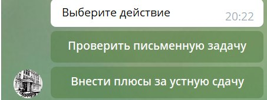
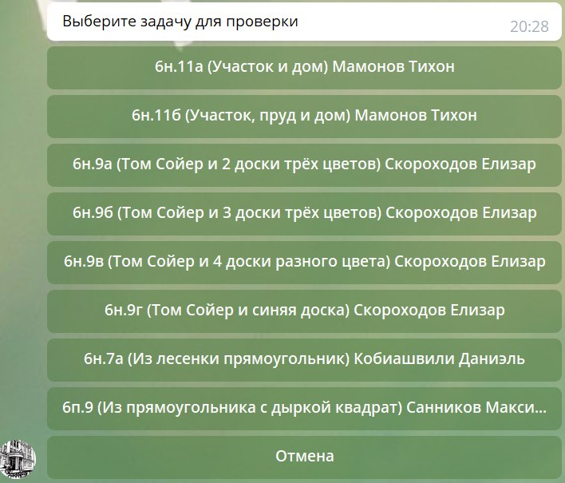
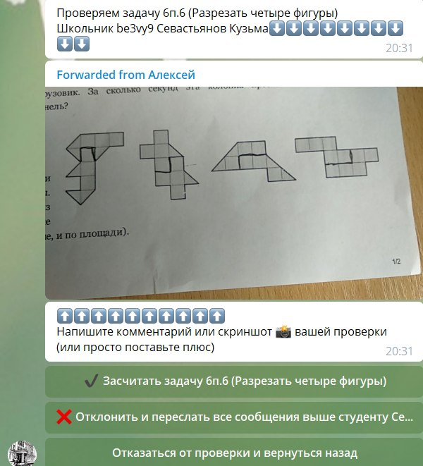
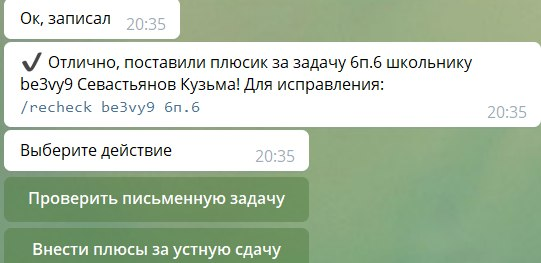
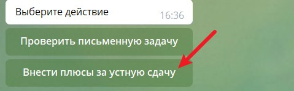
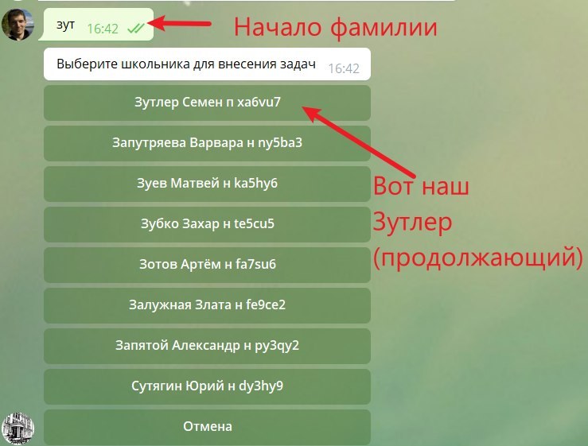
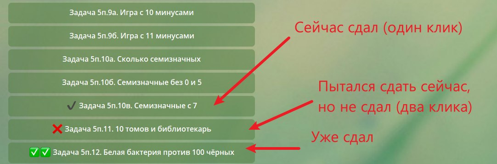

# Инструкция по работе в ВМШ-телеграм-боте

## Проверка письменных задач

В обычной ситуации бот будет спрашивать:
 

Выбираем «Проверить письменную задачу»
 

Выбираем задачу для проверки.
Если у задачи есть пункты, то нужно проверять их по порядку. Разные задачи можно проверять в произвольном порядке.
 

После начала проверки бот пересылает весь диалог по текущей задаче. 
Там могут быть комментарии предыдущего проверяющего и исправленная версия решения. 
Но чаще всего там ровно одна фотка с решением.

Если всё отлично, то отправляем подбадривающее сообщение в духе: «Да, отлично!», «Хорошее решение!» или «Круто!», после отправки сообщения жмём «Засчитать».
Если всё норм, то можно просто нажать «Засчитать».

Если что-то не так, то пишем подробно, что не так и как это исправить. 
Если видно, что школьник не понимает идею, то лучше дать подсказку.
Плохие комментарии: «Непонятно», «Что это?» и т.п. 
Хорошие: «Не доказано, что эти прямые пересекаются. Попробуйте посчитать угол такой-то».
Либо при помощи программулины snipaste делаете скриншот решения и стрелочками что-то помечаете и подписываете. 
Картинки можно комментировать прямо в телеграме, там есть для этого инструменты.
Желательно, чтобы комментарий был такой, чтобы было школьнику было ясно, в каком направлении двигаться для решения задачи.
Можно отправлять несколько комментариев, кроме того их можно редактировать или удалять.

Затем жмёте «Отклонить»

**Важно сначала отправить все сообщения, и только потом нажать «Засчитать» или «Отклонить».**
В случае ошибки можно ввести команду, которую предлагает бот (вида /recheck ab2cd4 7п.3к), тогда задачу можно перепроверить.

### Команды для учителей
- `/set_level` — Установить уровень школьнику
- `/recheck token problem` — Перепроверить студенту `token` письменную задачу `problem`
- `/find_student фамилия` — Найти студента по ФИО
- `/set_online token online/school` — Перевести студента в режим «Онлайн» или в режим «Школа»

## Проверка устных задач
TBD

## Внесение плюсиков за устные задачи
Выбираем «Внести плюсы за устную задачу»
 

Вводим начало фамилии (можно писать с опечатками)
 

Кликаем по нужным задачам
 
