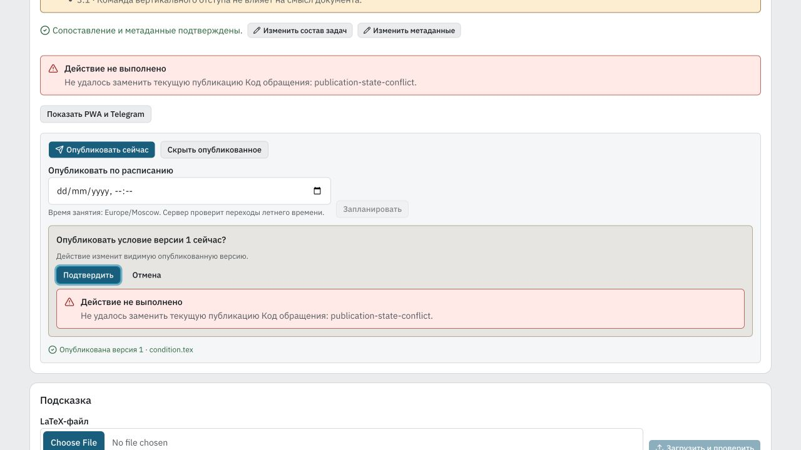

# Публикация и диагностика материалов — 4 октября 2026

[Требования, причины и компоненты](../../../vmshpwa/docs/content-recovery-20261004.md).

`make pwa-check-fast PWA_E2E_MODES="content figure-layout"`, с продолжением
после sandbox/socket и исправлений тестового bookkeeping: **2823 Python PASS /
7 SKIP, 1028 frontend, 356 Storybook, 6 Chromium E2E**. Прошедшие неизменённые
static steps сохранены; после изменения миграции повторён backend, затем
выполнены ещё не запускавшиеся frontend/Storybook/E2E.
[Сводка](gate-summary.json), [static](gate-static.json),
[продолжение](gate-resumed.json), [E2E](gate-e2e.json).
Firefox/WebKit не запускались; TLF не входит в выпуск.

Реальный E2E публикует первое условие через расписание, читает его как Student,
заменяет второй версией и откатывает к первой. Storybook проверяет серверную
причину и request ID под «Подтвердить», отсутствие ложного refetch,
два видимых блока с одним live announcement.

[Проверка двух предоставленных CP1251 файлов](source-probe.json): в условиях
и подсказках нет ошибок; отсутствующие `cube-scan1-sol` и `cubes-sol` нужны
только для решения, с прежними точными координатами 125:30 / 128:30.
Descriptors остальных рисунков в этом parser probe синтетические; реальные
upload/inventory/attach/compile проверены интеграционными HTTP-тестами.
Исходные файлы не изменялись.

[Серверная репетиция](migration-rehearsal.json) использует согласованную
временную копию, которая удаляется после проверки. Все 606 819 строк 158
таблиц сохранились; изменился только DDL `lesson_publications`. Прежние 627
legacy FK-ошибок остались ровно прежними, новых нет; integrity `ok`.
В копии проверены обе terminal transitions настоящего `gl-13` с сохранением
аудитных триггеров и происхождения; изменения probe отменены savepoint.
Production row data не выгружались. [Скрипт](rehearse-vmsh.py).

[Rollback source](rollback-source.json): `43b7d2f`,
`codex/content-recovery-rollback-20261004`. Сохраняет 0112 и актуальные schema
artifacts поверх предыдущего `b6476a52`. Проверены startup guard и замена
активированной публикации прежним backend. Миграция отказывает в обратном
DDL при наличии terminal schedule history; её нельзя удалять для отката кода.

Штатный guarded deploy ВМШ — следующий шаг. Учебные материалы пользователь
публикует сам; `gl-14` hint revision 6 и старая invalid `cr-75` не меняются
агентом.
