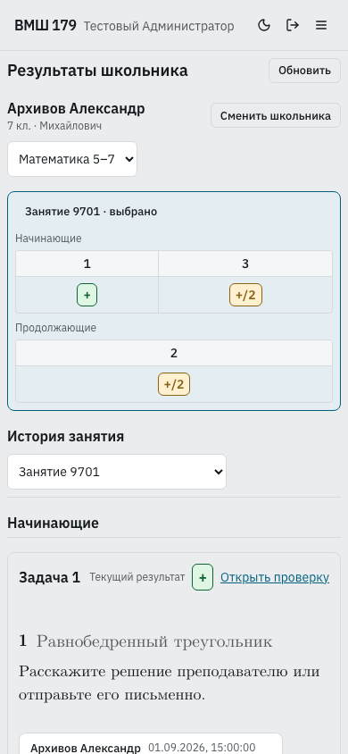

# Результаты школьника — проверка, 10 сентября 2026

Реализован админский `/staff/student-results` по
[принятому плану](../../../vmshpwa/docs/student-results.md).

## Выполненные проверки

| Проверка                                                                                                                             | Результат                                      |
| ------------------------------------------------------------------------------------------------------------------------------------ | ---------------------------------------------- |
| `.venv/bin/pytest -q -n0 pwa_tests/integration/test_student_results.py pwa_tests/integration/test_live_marking.py`                   | 21 passed                                      |
| `pnpm exec vitest run --project unit packages/contracts/src/student-results.test.ts apps/staff/src/student-directory-search.test.ts` | 9 passed                                       |
| `make pwa-e2e-student-results` через изолированный lock-aware runner                                                                 | 6 passed, Chromium/WebKit/Firefox, без retries |
| Staff `typecheck`, workspace `typecheck:tools`                                                                                       | passed                                         |
| ESLint изменённых TS/TSX, Ruff изменённых Python, Prettier                                                                           | passed                                         |

Все pnpm-команды выполнялись с `--config.verifyDepsBeforeRun=false`;
Make E2E — с `npm_config_verifyDepsBeforeRun=false` и
`npm_config_verify_deps_before_run=false`. Production bundles Student, Family и
Staff собраны runner-ом. Сервер — изолированный `pwa-e2e`, origin 127.0.0.1:5380,
без MSW, Telegram/Google и доступа к production/human данным.

Backend проверяет admin-only, архивного школьника без аккаунта и зачисления,
несколько курсов и старые/пустые занятия, реальные дробные символы,
дедупликацию по связям, исключение черновиков, прошлые проверки и исправления,
undo оценок/Zoom-пометок, переносы частей материалов, move/clone посылок,
аннотации, отсутствующие вложения и запрет произвольных путей/симлинков.
После уточнения подписей источника/назначения старых переносов их отдельный
сценарий дополнительно прошёл (`1 passed`).

[Браузерный сценарий](../../../vmshpwa/e2e/student-results.spec.ts) проверяет:
поиск с опечаткой «Архивво», два курса и два уровня, только отправленные задачи,
дробные оценки и устную задачу без карточки посылки, загрузку настоящего WebP и
аннотаций, две проверки, продолжение 50+ событий, связанное условие, восстановление
фокуса после Escape, открытие и полную загрузку существующей проверки, один Back
к прежнему URL, пустое занятие, 320/390 px, desktop, тёмную тему, 200% и offline.
Второй сценарий проверяет закрытый экран/API для преподавателя.

Найдены и исправлены: возврат фокуса Safari у нативных ячеек и лишний шаг
автоматической нормализации URL существующей истории проверки. Начальные
ошибки синтетического seed и теста устранены; финальный прогон не имеет flaky.

## Снимки

Синтетическая фотография построена для тестов; персональные данные вымышленные.
Снимки каждой платформы просмотрены на контрольных desktop/mobile/theme состояниях.

| Браузер  | Desktop                                | 320 px                                    | 390 px                                    | Тёмная тема                         | 200%                                    | Фотографии и проверки                            |
| -------- | -------------------------------------- | ----------------------------------------- | ----------------------------------------- | ----------------------------------- | --------------------------------------- | ------------------------------------------------ |
| Chromium | [снимок](chromium-results-desktop.png) | [снимок](chromium-results-mobile-320.png) | [снимок](chromium-results-mobile-390.png) | [снимок](chromium-results-dark.png) | [снимок](chromium-results-zoom-200.png) | [снимок](chromium-results-photo-annotations.png) |
| WebKit   | [снимок](webkit-results-desktop.png)   | [снимок](webkit-results-mobile-320.png)   | [снимок](webkit-results-mobile-390.png)   | [снимок](webkit-results-dark.png)   | [снимок](webkit-results-zoom-200.png)   | [снимок](webkit-results-photo-annotations.png)   |
| Firefox  | [снимок](firefox-results-desktop.png)  | [снимок](firefox-results-mobile-320.png)  | [снимок](firefox-results-mobile-390.png)  | [снимок](firefox-results-dark.png)  | [снимок](firefox-results-zoom-200.png)  | [снимок](firefox-results-photo-annotations.png)  |

Миграций и преобразования данных нет. Восстановление утраченных файлов и старых
значений без журнала не входит в обещанную полноту архива. Визуальное принятие
владельцем и выпуск остаются следующими действиями. Владелец разрешил commit и push
10 сентября 2026.
