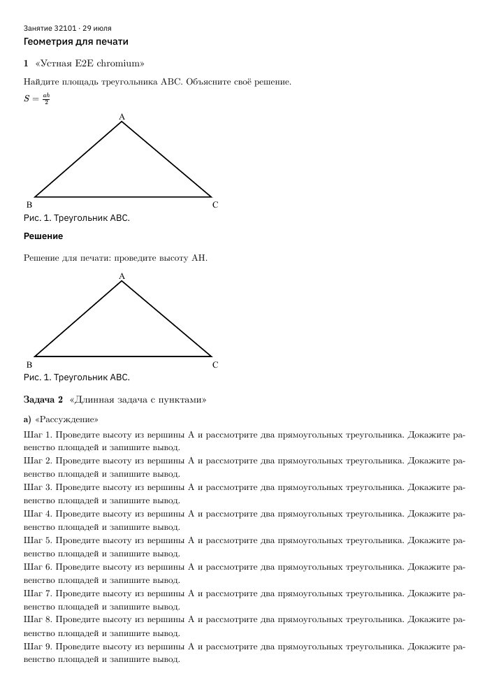
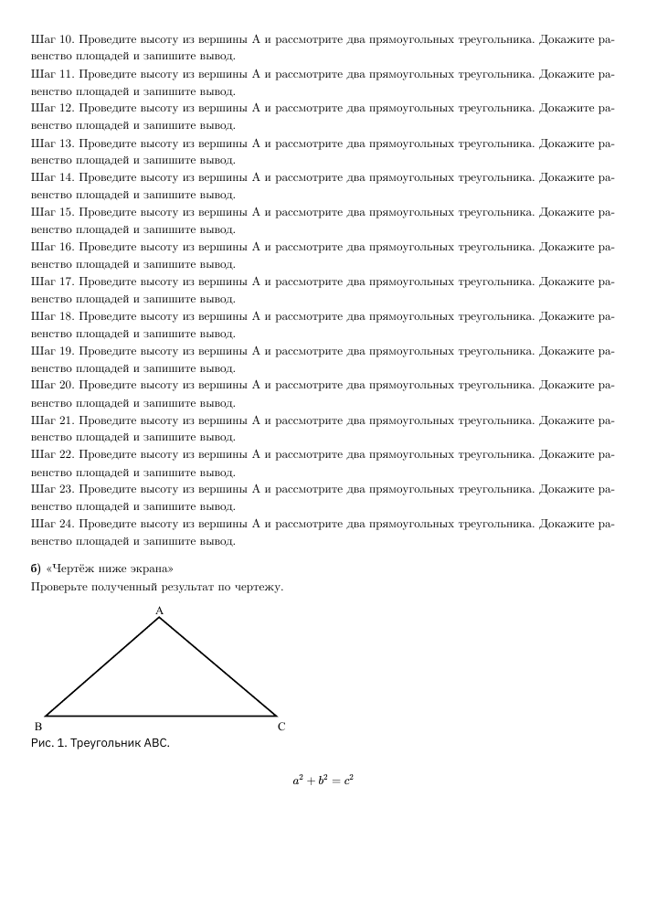

# Печать ученических листков — 11 сентября 2026

Реализован [контракт печати](../../../vmshpwa/docs/worksheet-print.md).
`/student/tasks`, отдельный листок и задача печатают условия и раскрытые
материалы. Ответы, фотографии работ и переписка исключены. API и пользовательское
состояние не меняются.

## Проверки

- **3 E2E passed:** Chromium, WebKit, Firefox; production bundles и настоящий
  изолированный aiohttp/SQLite через lock-aware `exclusive_e2e_run` / `run_commands`.
  [Сценарий](../../../vmshpwa/e2e/worksheet-print.spec.ts),
  [опубликованные фикстуры](../../../vmshpwa/scripts/seed_e2e_worksheet_print.py).
- Закрытые материалы, открытая подсказка, открытое решение; одновременно открыты
  отправленная работа с фотографией, черновик следующего ответа и форма вопроса.
  В печати ответ и фото скрыты, открытый учебный материал виден. После выхода
  черновики и экранный масштаб рисунка сохранены.
- Иллюстрации ниже экрана загружены до первого перехода в print media;
  закрытые материалы при печати не запрашиваются. Пять показанных занятий
  сохраняются в том же количестве, пагинация архива не запускается.
- **13 unit passed:** `packages/content/src/math-document.test.tsx`.
- **1 Storybook interaction passed:** `EagerWorksheetImages` в
  `packages/content/src/math-document.stories.tsx`; eager-loading и независимый
  редакционный масштаб при пользовательском увеличении. Остальные stories
  не входили в этот целевой запуск.
- **105 pytest passed:** `pwa_tests/test_seed_runtime.py`.
- Все production builds, workspace typecheck, tools typecheck, scoped
  ESLint/Stylelint/Prettier и `git diff --check` пройдены.

Печатный CSS просмотрен в светлой и тёмной темах каждого браузера. Фактическая
пагинация PDF проверена в Chromium: A4 (594,96 × 841,92 pt), поля 10 мм,
11 pt, без пустых страниц. В WebKit/Firefox проверялся `emulateMedia('print')`,
а не системный диалог печати.

В ходе проверки исправлена ошибка Chromium: строчный контейнер вывода KaTeX
создавал лишние страницы после длинного пункта. Печатный контейнер теперь
блочный. Регрессионный тест проверяет именно полученный PDF: две страницы для
фиксированного длинного листка вместо прежних четырёх. `pdftotext` дополнительно
проверил непустой текст каждой страницы и отсутствие ответов/кнопок.

## PDF и снимки

- [Листок с раскрытым решением — 2 страницы](lesson-solution-chromium.pdf).
- [Листок с закрытыми материалами — 2 страницы](lesson-closed-chromium.pdf).
- [Пять показанных занятий — 10 страниц](worksheets-chromium.pdf), каждое
  начинается с новой страницы, длинные задачи продолжаются на следующей.

| Браузер  | Всё закрыто, светлая тема           | Подсказка                         | Решение, тёмная тема                 | Пять занятий                     |
| -------- | ----------------------------------- | --------------------------------- | ------------------------------------ | -------------------------------- |
| Chromium | [Снимок](chromium-closed-light.png) | [Снимок](chromium-hint-light.png) | [Снимок](chromium-solution-dark.png) | [Снимок](chromium-feed-dark.png) |
| WebKit   | [Снимок](webkit-closed-light.png)   | [Снимок](webkit-hint-light.png)   | [Снимок](webkit-solution-dark.png)   | [Снимок](webkit-feed-dark.png)   |
| Firefox  | [Снимок](firefox-closed-light.png)  | [Снимок](firefox-hint-light.png)  | [Снимок](firefox-solution-dark.png)  | [Снимок](firefox-feed-dark.png)  |

Страницы PDF просмотрены после растеризации:





## Воспроизведение E2E

Из корня репозитория, с агентским изолированным runtime:

```sh
npm_config_verifyDepsBeforeRun=false npm_config_verify_deps_before_run=false .venv/bin/python - <<'PY'
from vmshpwa.scripts.e2e_runner import exclusive_e2e_run, run_commands
with exclusive_e2e_run():
    raise SystemExit(run_commands([
        ('pnpm', 'build'),
        ('pnpm', 'exec', 'playwright', 'test', 'e2e/worksheet-print.spec.ts', '--retries=0'),
    ], reset_database_between_commands=True))
PY
```

Миграций нет. Владелец разрешил commit/push 11 сентября 2026. Колонтитулы URL/даты остаются настройкой системного диалога.
