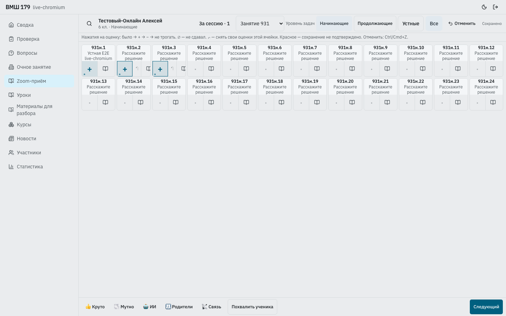

# Уровни задач на устном приёме — 16 сентября 2026

Требования: [live-marking.md](../docs/live-marking.md).

## Изменения

- [live-marking-page.tsx](../apps/staff/src/live-marking-page.tsx): две кнопки
  «Устные / Все», отдельные уровни задач, подписи посещений. Карточка школьника
  продолжает показывать enrollment. Очный переключатель не изменён.
- [live-marking-state.ts](../apps/staff/src/live-marking-state.ts): явный листок URL
  имеет приоритет над уровнем школьника, уровни сопоставляются по номеру занятия;
  отсутствующий номер не заменяется другим. При отсутствии собственных публикаций
  остаётся пустое состояние с выбором другого уровня.
- Очередь не пересоздаётся при навигации. Статус учитывает всю сессию.
  Для повтора конфликтующей оценки читается версия ячейки исходного листка,
  даже если он сейчас скрыт. API, enrollment и миграции не изменялись.

## Проверка

- 30 unit-тестов: выбор листка, очередь IndexedDB, гонки подтверждений, поиск,
  отображение оценок (`live-marking-state/page/grid`, `live-marking-outbox`).
- 14 backend-тестов: `pwa_tests/integration/test_live_marking.py`, временные БД.
- `make pwa-e2e-live-marking`: реальный изолированный backend, три браузера;
  **15 passed (4.2m)**, без повторов; [результат](oral-levels-artifacts/e2e.txt).
- Новый сценарий в [live-marking.spec.ts](../e2e/live-marking.spec.ts): два плюса
  начинающих, удержание сетевого ответа, переход на продолжающих и третий плюс;
  одна сессия, неизменная группа, reload/back, посещения, сохранённый фильтр,
  offline-переход и undo, клавиатура, ширины 1440/390/320, светлая/тёмная тема.
- Существующие сценарии проверяют очный ввод, чужие оценки через WebSocket,
  переподключение, неподтверждённые изменения и повторы отправки.
- Пустой каталог, уровень без собственных публикаций и недоступное занятие
  проверены unit-тестами выбора. В браузере эти отдельные состояния не моделируются.

Первый прогон выявил устаревшее требование теста: все 24 задачи должны помещаться
в высоту 844 px без прокрутки. С новой строкой уровней последняя строка ниже;
проверка теперь требует доступности всей последней строки после прокрутки.
Снимок 390 px просмотрен вручную. Второй запуск остановился на импорте контракта
в тесте; исправлен на такой же относительный импорт, как в других E2E.

Финальные проверки: TypeScript Staff и workspace tooling, целевой ESLint,
`git diff --check`, production-сборки всех приложений прошли.
Дополнительно устранена неоднозначность E2E-селектора статуса: сетевой баннер
и статус очереди имеют одинаковую роль, проверяется конкретно «не отправлено».

## Снимки финального прогона

Chromium desktop:

[Chromium 390](oral-levels-artifacts/chromium-390.png),
[WebKit 320](oral-levels-artifacts/webkit-320.png),
[Firefox 390](oral-levels-artifacts/firefox-390.png).

Тёмная тема:
[Chromium](oral-levels-artifacts/chromium-dark.png),
[WebKit](oral-levels-artifacts/webkit-dark.png),
[Firefox](oral-levels-artifacts/firefox-dark.png).

Изменения выпускаются отдельным коммитом. Production в этой задаче не менялся.

## Production: восстановление выпуска, 16 сентября 2026, 10:04 UTC

После сбоя deploy health-check активным оставался `540767ecd8e7-20260916051920`.
Проверен и штатно активирован готовый `ff9f2fb6a496-20260916080639` через
`static_release activate`, без перезапуска backend. Публичные Staff HTML и JS
с «Уровень задач» совпадают с файлами релиза; три runtime вернули HTTP 200.
Предыдущий релиз сохранён. Ошибка TCP health-check в установленном deploy-скрипте
остаётся отдельной проблемой: доверенный upstream использует Unix-сокет.
