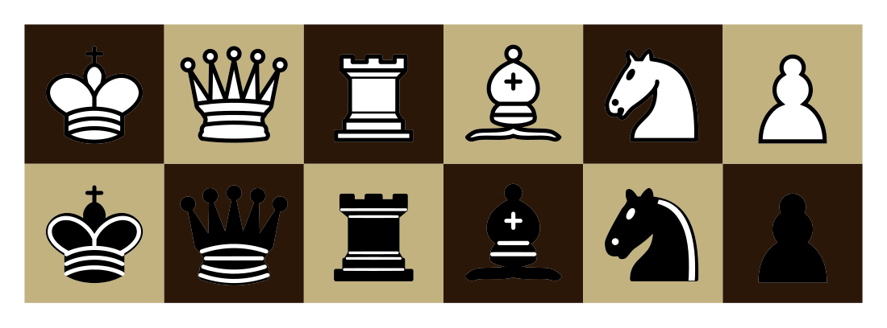
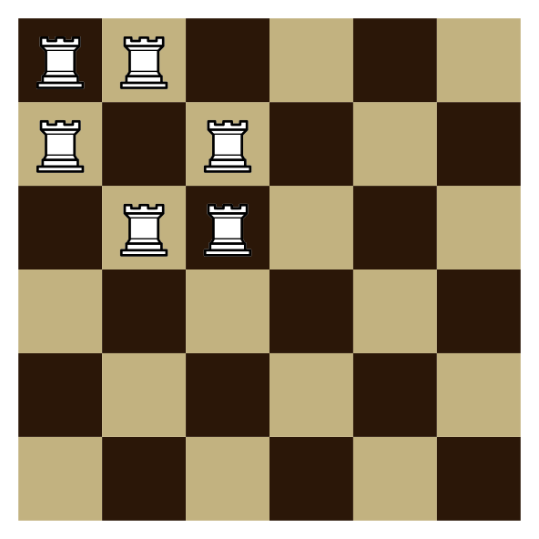
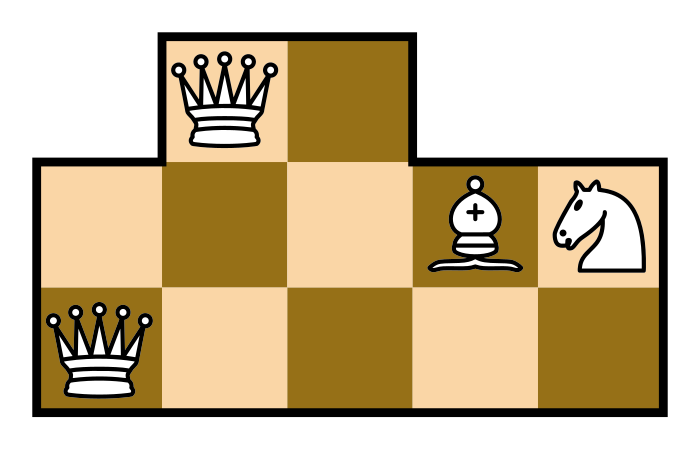

# Векторные шахматные фигуры — 14 сентября 2026

Реализован [контракт](../docs/tikz-chess.md): 12 нативных TikZ-фигур с прежними
именами и координатами, без PNG и специальных шрифтов. Использованы контуры
авторского комплекта фигур. Санитайзер SVG и конвертер не изменены.

Проверки: 99 passed (`pytest -n 2` для `test_tikz_chess.py`,
`test_content_tikz.py`, `test_content_compiler.py`, `test_tikz_chess_smoke.py`).
Реальные pdfLaTeX и pdf2svg скомпилировали пример с шестью ладьями и все 12
фигур; проверены отсутствие `<image>` и растровых data URI, масштаб ×2 и
очистка временной папки. Снимки просмотрены визуально. Ruff и diff-check
прошли. Проверка загрузки на production не выполнялась.

## Все фигуры

[Векторный SVG](assets/tikz-chess/all-pieces.svg).

## Исходный пример с ладьями

[Векторный SVG](assets/tikz-chess/rooks.svg).

## Исправление прямых includegraphics — 14 сентября 2026

Ошибка gl-4 была вызвана прямыми `includegraphics{QueenWhite}`: такие вставки
не используют ChessPiece и раньше пытались прочитать отсутствующий PNG.
Теперь известные имена заменяются в производном исходнике на векторную
команду с параметрами размера; остальные изображения и комментарии сохраняются.

[Исходный пример](assets/tikz-chess/legacy-queen.tex) успешно прошёл настоящий
pdfLaTeX → pdf2svg. [SVG](assets/tikz-chess/legacy-queen.svg) просмотрен:
два ферзя, слон и конь расположены согласно исходнику, растра нет.

Проверки: 103 passed (четыре набора из основного отчёта); Ruff и diff-check прошли.
Production не изменялся.
