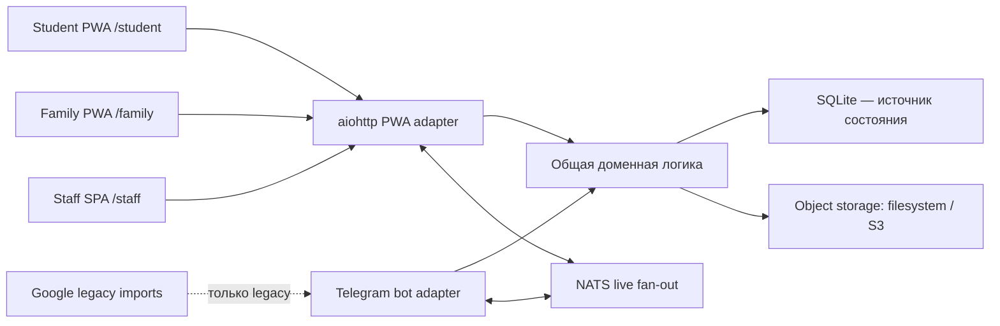

# Архитектура

## Граница системы

Новый интерфейс живёт в pnpm workspace `vmshpwa`, но backend остаётся в существующих `apps/`, `models/`, `db_methods/`, `handlers/` и `migrations/`. `main.py` является совместимой legacy-точкой и app factory с явным набором adapters. Профиль `pwa-*` загружает только `apps.pwa_app`, поэтому HTTP можно поднять без Telegram и Google.

NATS ускоряет доставку общих или audience-scoped invalidation между процессами, но не является журналом. После любого reconnect клиент запрашивает версию и полное актуальное состояние из SQLite. Owner-scoped события появятся только вместе с authenticated WebSocket principal; audience scope нельзя выдавать за пользовательскую приватность.

SQLite concurrency до первой бизнес-миграции фиксируется отдельным ADR. Один connection не обслуживает конкурентные coroutine; блокирующие DB/CPU operations вынесены с event loop, `busy_timeout`/bounded retry наблюдаемы, а внутри write transaction нет `await` или network I/O. Новые `models/pwa`/`db_methods/pwa` — namespace реализации, но не отдельная предметная модель: затронутые PWA и Telegram write paths вызывают общую domain service/unit of work.

Telegram bot token принадлежит runtime credential profile, а destination не зашит в него: каждая учебная группа хранит verified canonical Bot API channel ID в SQLite. Content/news adapter разрешает destination через `group_id`, сохраняет реально использованные chat/message IDs и никогда не отправляет в глобальный fallback. Live test profile использует `@vmsh179devbot` и отдельную test-group mapping; hermetic unit/E2E остаются на RecordingBot.

## Frontend workspace

- `apps/student`: mobile-first installable PWA, base/scope `/student/`;
- `apps/family`: installable PWA, base/scope `/family/`;
- `apps/staff`: desktop-first адаптивное SPA, base `/staff/`;
- `packages/ui`: визуально нейтральные primitives и semantic tokens без domain imports;
- `packages/app-shell`: providers, layout и общие application patterns;
- `packages/contracts`: ручные Zod-схемы API/events и contract fixtures;
- `packages/content`: отображение математических документов и артефактов;
- `packages/offline`: Dexie namespaces, drafts/outbox и чистая sync-логика;
- `packages/test-utils`: MSW handlers и детерминированные fixtures, только для тестов/Storybook.

Каждое приложение имеет свой route tree. TanStack Router генерирует его из файлов и режет маршруты автоматически. Тяжёлые редакторы, PDF/TikZ preview, Visx charts, TanStack Table/Virtual grids и image processing подключаются через dynamic import; обработка фотографий выполняется в Web Worker. React Compiler не используется.

## Production URL

| Audience | UI           | API                 | WebSocket     | Session cookie path |
| -------- | ------------ | ------------------- | ------------- | ------------------- |
| Student  | `/student/*` | `/student/api/v1/*` | `/student/ws` | `/student`          |
| Family   | `/family/*`  | `/family/api/v1/*`  | `/family/ws`  | `/family`           |
| Staff    | `/staff/*`   | `/staff/api/v1/*`   | `/staff/ws`   | `/staff`            |

Reverse proxy обязан отдавать соответствующий `index.html` только для browser-navigation внутри UI base, но никогда не подменять им `/api` или `/ws`.

Каждый aiohttp adapter экспортирует `configure(app)`. Старое ошибочное имя `configue` временно оставлено alias-ом для внешней совместимости и не используется новым launcher-кодом.

## API conventions

- JSON в camelCase, ISO 8601 UTC timestamps, стабильные строковые IDs.
- Любой ответ имеет `X-Request-ID`; входной безопасный request ID может быть принят, иначе создаётся новый.
- Ошибка: `{ "error": { "code", "message", "requestId", "details?" } }`.
- Mutations с риском повтора принимают `Idempotency-Key` и возвращают устойчивый результат повторной операции.
- TypeScript и Python контракты поддерживаются вручную; Zod проверяет ответы на runtime, fixtures проверяют обе стороны. OpenAPI/codegen на этом этапе не вводится.

## Object storage

Доменный код использует интерфейс `put/get/delete`. Unit/agent/E2E adapter пишет только внутрь выделенного media root и запрещает absolute/path traversal. Opt-in local integration и production используют Beget S3-compatible bucket через `aioboto3`; browser upload всегда проксируется aiohttp, presigned upload не является частью контракта. Метаданные, связи, attachment revisions и audit остаются в SQLite.

Общий Python config содержит `s3_url` (default `https://s3.ru1.storage.beget.cloud`), nullable `s3_bucket_name`, `s3_access_key`, `s3_secret_key`. Для ручной local/test S3-интеграции эти четыре allowlisted поля читаются из `creds_test/vmsh_bot_config_test.json`, для production — из `creds_prod/vmsh_bot_config_prod.json`. Agent и обычный E2E не читают эти файлы и используют filesystem. Выбор S3 adapter при неполном наборе настроек завершается config error; access/secret key не входят в config representation, logs, Sentry, health или client contracts.

Content assets используют content-addressed keys. Фотографии решений используют непредсказуемые immutable revision keys вида `sol_imgs/user_{user_id}/{season_year}/{lesson_id}/{problem_id}_{created_at_utc}_{uuid}.webp` и публичный GET. После verdict object не перезаписывается и не удаляется приложением.

## Многокурсовая предметная граница

Один aiohttp backend обслуживает иерархию `season → course → group → course/group lesson`; отдельного backend на курс нет. API, query keys, WebSocket invalidations и browser URL state несут `courseId`/`groupId`, когда ресурс не глобален. Staff permission scope проверяется сервером на уровне course/group и возвращает `403`.

Синонимы задач реализуются read-model projection поверх неизменяемых concrete `problem_id` и submission/result IDs. Очное расписание моделируется отдельным `in_person_event`, а не глобальным номером занятия. Полная схема владения и контракты: [Курсы, группы и занятия](courses-groups-and-lessons.md).
