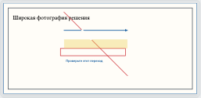

# Геометрия разметки фотографии

## Требование

Рисование покрывает всю фотографию при любой пропорции, масштабе и повороте.
Уже сохранённые пометки, включая локальные черновики, сохраняют прежнее положение.
Записи в базе, координаты и исходные фотографии не пересчитываются.

## Совместимость

Прежний браузерный SVG `viewBox="0 0 1 1"` использовал стандартное
`xMidYMid meet`: единичный квадрат располагался в центре фотографии. Простая
замена на `preserveAspectRatio="none"` сдвигает старые пометки и недопустима.

Новые элементы явно содержат `coordinateSpace: "image"`; отсутствие поля означает
прежний квадрат. Это признак отдельной пометки, поэтому исправленная проверка
может содержать старые и новые элементы одновременно. Все инструменты, включая
ластик и текст, сохраняют этот признак; undo/redo сохраняет исходные элементы.
Сервер принимает только отсутствующее поле или `image`, хранит признак в прежнем
`marks_json` и возвращает его при чтении. Миграция не нужна; старый JSON не меняется.

Общий браузерный рендерер отображает старые элементы в прежней геометрии, новые —
по всей фотографии. Прежние ограничения координат, число точек, размер и
неизменяемость завершённой проверки сохраняются. Старые сгенерированные PNG и
Telegram-сообщения не изменяются; серверный композитор и раньше использовал
координаты всей фотографии и остаётся без изменений.

## Реализация и проверка

- `packages/product/src/review-annotation-{surface,editor}.tsx`: ввод координат,
  геометрия старых и новых элементов, общий просмотр Student/Family/Staff.
- `packages/contracts/src/review-queue.ts`: необязательный признак координат.
- `apps/pwa_api/review_routes.py`, `db_methods/pwa/reviews.py`: валидация и
  сохранение без перезаписи существующих записей.
- `packages/product/src/review-annotation.stories.tsx`: сравнение с прежним SVG,
  горизонтальная/вертикальная фотография, ширины 320/960, четыре поворота,
  масштабы 1/1.5, а также редактирование и undo/redo.
- `pwa_tests/integration/test_review_queue_{repository,http_api}.py`:
  сохранение смешанного набора, идемпотентность, неизменяемость и отклонение
  неизвестных систем координат.

## Результаты проверки

- До исправления браузерная проверка границ воспроизвела ошибку на горизонтальной
  и вертикальной фотографии.
- Chromium: 5 stories прошли, включая рисование, undo/redo, просмотр и совместимость.
- Firefox и WebKit: сравнение старых пометок с прежним SVG прошло в каждом браузере
  на 32 комбинациях размеров/поворота/масштаба. Геометрия текста, стрелок, линий,
  прямоугольников, выделений и ластика сохраняется с допуском менее 1 px.
- Полный pointer-story в Firefox не используется как доказательство: синтетический
  `userEvent.pointer` не создаёт системный pointer ID для `setPointerCapture`.
  Проверка геометрии не подменяет этот API и проходит в реальном Firefox.
- Backend: 17 тестов пройдены (9 repository, 2 aiohttp, 6 parser), включая
  сохранение всех старых элементов при добавлении нового, повторную отправку,
  запрет изменения завершённой записи и неизвестные значения coordinateSpace.
- 12 контрактных unit-тестов, product typecheck, ESLint, Prettier, diff-check прошли.
- Снимок проверен визуально: синяя рамка новой пометки идёт по всей фотографии,
  старые красные/жёлтые пометки остаются в прежних координатах.

