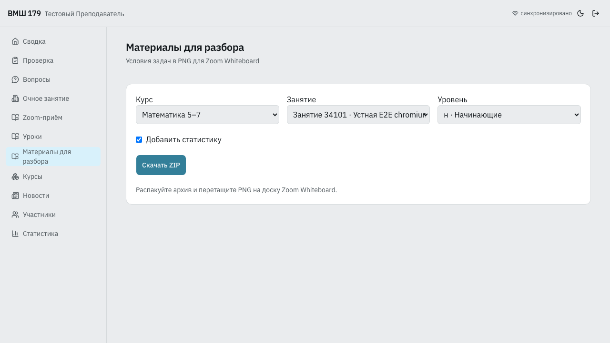
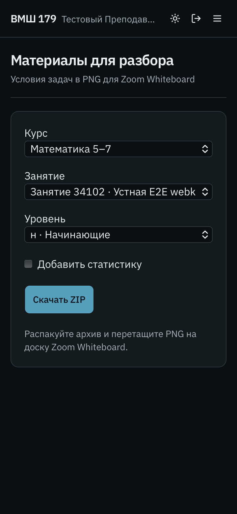

# Проверка материалов для Zoom Whiteboard

2026-09-13. Требования: [whiteboard-export.md](whiteboard-export.md).

Реализация: Staff `/whiteboard-export`, `whiteboard-export-page.tsx`,
`whiteboard-export-generator.tsx`, `whiteboard-zip.worker.ts`;
контракт `packages/contracts/src/whiteboard-export.ts`;
API `apps/pwa_api/whiteboard_export_routes.py`, чтение публикаций
`db_methods/pwa/whiteboard_export.py`.

Backend: `pwa_tests/integration/test_whiteboard_export.py` — 3 passed.
Проверены роли, область преподавателя, архивная публикация, отсутствие публикации,
недоступный/чужой asset, явное исключение статистики при ошибке, совпадение базовых
показателей с `/staff/api/v1/statistics` после ответа школьника.

Браузерные проверки: `e2e/whiteboard-export.spec.ts` и `e2e/worksheet-print.spec.ts`.
Выполнены на отдельной SQLite через lock-aware `scripts/e2e_runner.py`.
Набор `scripts/seed_e2e_whiteboard.py` содержит введение, KaTeX, SVG, цветной PNG
и длинную задачу с пунктами. Проверяется скачанный архив, а не только DOM.

Ограничение экспорта: не более 16 млн пикселей на PNG и 16000 px по высоте;
превышение останавливает весь архив с указанием задачи. Ресурсы и canvas
обрабатываются последовательно; ZIP собирается отдельным worker.

Остаётся финальная пользовательская приёмка: распаковать ZIP и перетащить PNG
в Zoom Whiteboard. Автоматический прогон не управляет Zoom.

| Проверка                                                  | Chromium | WebKit | Firefox |
| --------------------------------------------------------- | -------- | ------ | ------- |
| ZIP: состав и кириллические имена                         | passed   | passed | passed  |
| PNG: ширина 1600, текст, SVG и цветной растр              | passed   | passed | passed  |
| Desktop/light и 360 px/dark                               | passed   | passed | passed  |
| Отмена, недоступный рисунок, повтор                       | passed   | passed | passed  |
| Обычная печать, раскрытые материалы, сохранение черновика | passed   | passed | passed  |

Размеры PNG совпадают между темами и ширинами экрана. При сравнении пикселей
допущено менее 0,1% расхождений для сглаживания SVG; текст и рисунки проверены
визуально. WebKit требует отдельного композитинга изображений на canvas —
захват через один `foreignObject` мог терять растровые рисунки. В Firefox
регрессионный тест повторно раскрывает форму после live-обновления перед
проверкой очищенного черновика. Финальный повтор проверки печати: 1 passed.
Chromium дополнительно проверяет реальное число страниц PDF (2).

Typecheck всего workspace, повторный Staff typecheck, ESLint, Stylelint,
Ruff и `git diff --check` прошли. Unit-проверки content/contracts: 37 файлов,
268 тестов прошли.

[Пример ZIP](assets/whiteboard-export/example.zip) ·
[Длинная задача](assets/whiteboard-export/long-task.png) ·
[Статистика](assets/whiteboard-export/statistics.png)

PNG одной задачи:
[Chromium](assets/whiteboard-export/chromium-task.png),
[WebKit](assets/whiteboard-export/webkit-task.png),
[Firefox](assets/whiteboard-export/firefox-task.png).
